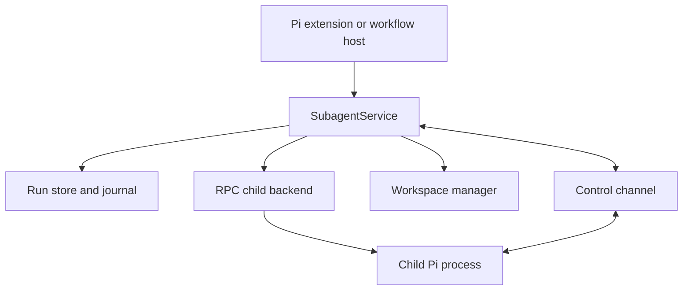

# Architecture

## Boundary

`pi-subagent` owns delegated-agent execution. It does not own workflow graphs,
Maestro plans, publication, or repository-delivery policy.



## Layers

1. **Extension adapter** registers the `subagent` tool, commands, and UI.
2. **Service** exposes the same runtime to trusted extension consumers.
3. **Policy compiler** resolves an immutable launch plan.
4. **Lifecycle runtime** owns runs, attempts, status, retry, and resume.
5. **Backend** owns child Pi startup, RPC, event collection, and settlement.
6. **Process supervisor** owns process identity, signals, and cleanup proof.
7. **Workspace manager** owns shared/worktree/sandbox preparation and handoff.
8. **Store** owns append-only events, bounded snapshots, artifacts, and leases in a supervisor root outside child workspaces.

No model-facing tool may bypass the service.

## Canonical backend

The first backend is a child Pi process in classic RPC mode. The supervisor
implements the documented JSONL protocol directly so it can own process groups,
stdio, readiness, and terminal evidence; Pi's convenience `RpcClient` does not
expose the required spawn controls. Stock RPC is not reconnectable: supervisor
loss interrupts the child, and recovery uses validated session resume rather
than live stdio adoption.

Children start with ambient extensions disabled. The launch plan supplies only
the extension providers needed for granted tools:

```text
pi --mode rpc --no-extensions --extension <provider> ...
```

JSON mode may be supported for one-shot compatibility. In-process and tmux
backends are later additions and must preserve the same run/attempt contracts.

## Platform use

Use Pi rather than rebuilding:

- `getAgentDir()` and `CONFIG_DIR_NAME`;
- `ModelRuntime` and provider authentication;
- `AgentSession`, `SessionManager`, and RPC;
- built-in tool factories and tool schemas;
- project trust and resource provenance;
- extension lifecycle and UI APIs.

This repository owns what Pi does not provide: subagent supervision, process
trees, run persistence, worktrees, capability projection, named-agent discovery,
and recovery. Pi packages do not define an agent resource category, so packaged
agent definitions use an explicit pi-subagent manifest convention.

## Dependency rule

`pi-workflow` depends on the public service contract. `pi-subagent` has no
runtime dependency on pi-workflow or pi-maestro.
