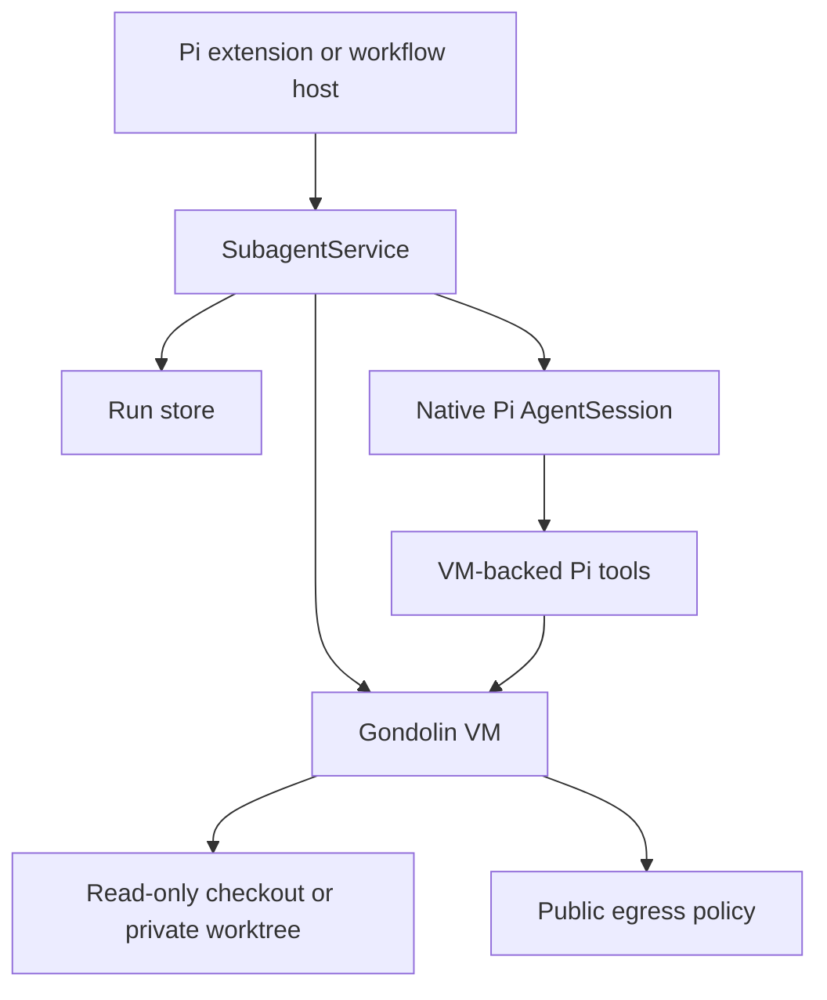
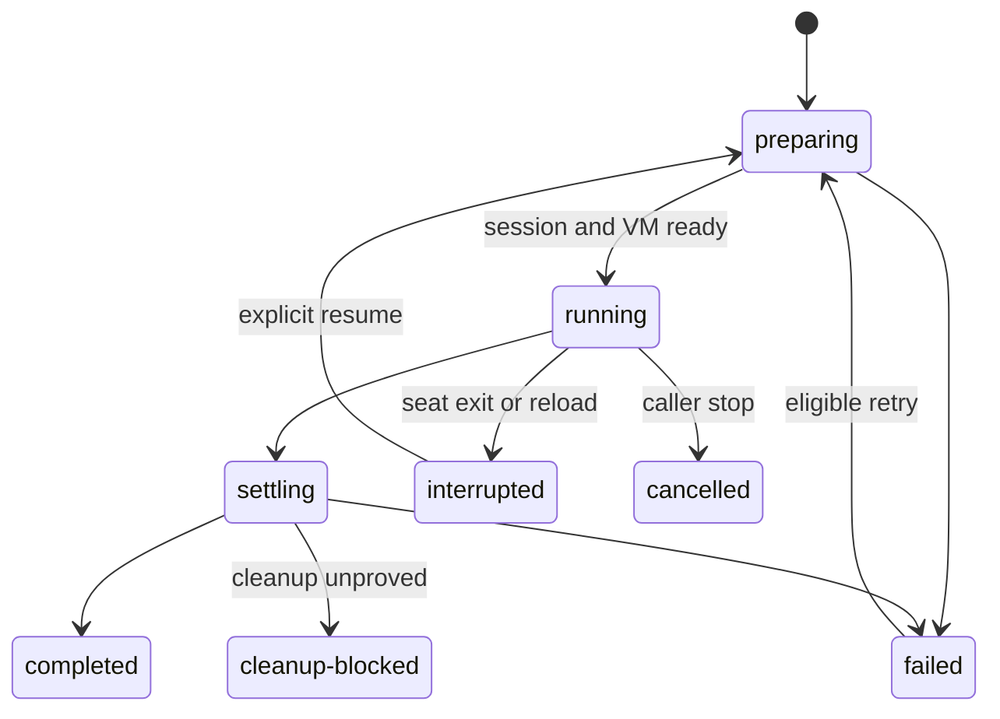

# Architecture

## Boundary

`pi-subagent` owns delegated-agent execution. It does not own workflow graphs,
Maestro plans, publication, or repository-delivery policy.



## Canonical execution model

Each active attempt has one native in-process Pi `AgentSession` and one
Gondolin Linux micro-VM. The seat owns model inference, provider authentication,
session persistence, lifecycle state, and Git operations. Model-driven tool
effects cross the VM boundary.

There is no child Pi process and no detached supervisor in the initial runtime.
Active attempts stop when their owning seat exits or reloads. A fenced
cross-process lease prevents another seat from concurrently mutating the same
run, session, or worktree. Explicit resume restores the persisted Pi session
into a new attempt with a fresh VM only after the prior seat and VM are proved
terminal and authority and workspace identity are revalidated.

One VM belongs to exactly one attempt. VMs are not pooled or shared between
agents. Before VM creation, the seat reserves one pi-subagent capacity slot by
binding its deterministic localhost TCP listener. An atomically installed
capacity policy rejects seats with a different slot count or port range. The OS
makes acquisition atomic across seats and releases the slot if its owner process
dies. The guest
cannot reach these listeners because internal-network access is blocked. This
makes filesystem, process, network, capacity, cancellation, and cleanup state
attributable to one attempt.

## Layers

1. **Extension adapter** registers model-facing tools, commands, and UI.
2. **Service** exposes the same runtime to trusted extension consumers.
3. **Policy compiler** resolves an immutable launch plan.
4. **Lifecycle runtime** owns runs, attempts, cancellation, retry, and resume.
5. **Session runtime** creates native `AgentSession`s with explicit resources.
6. **Sandbox adapter** owns Gondolin VM creation, policy, and terminal proof.
7. **Tool adapter** routes every granted model-facing operation into the VM.
8. **Workspace manager** owns read-only mounts, worktrees, handoff, and cleanup.
9. **Store** owns bounded records, sessions, artifacts, and recovery evidence
   outside mounted workspaces.

No model-facing tool may bypass the service or use host-backed filesystem,
process, or network operations.

Operator inspection uses the same service. Metadata listing, retained-run
recovery, lifecycle logs, pins, and retention initialize without model,
Gondolin-asset, or capacity setup. Execution dependencies remain lazy until
preflight or launch. The unified `/subagents` command uses operator-level bounded
listing for current-project/all-project views; mutations still route through the
recorded owner client and existing run fences.

## Resource isolation

Child sessions disable ambient extensions, prompt templates, themes, and context
files. Normal Pi global/package skills and trusted-project skills are discovered
on the host, bound into the launch identity, advertised through the standard
progressive-disclosure catalog, and mounted read-only under `/skills` in the VM.
`preloadSkills` injects selected full instructions before the first turn.
Agent-required and request-selected `contextScopes` explicitly project Pi's
global context and/or trusted-project ancestor context chain. Context files are
bounded, digest-bound, injected through Pi's normal context-file mechanism, and
mounted read-only under synthetic `/context` guest paths. Ambient context remains
disabled. Only preflighted resources are projected into the session. Arbitrary
extension code is not loaded into a child session in the initial release;
trusted capabilities must have a
pi-subagent-owned adapter whose authority is part of the launch plan.

Models and provider credentials stay in the seat through Pi's `ModelRuntime`.
The VM does not receive Pi settings, provider auth files, the user home, or the
Pi agent directory.

## Tool isolation

The initial built-in set is implemented with Pi tool factories and
Gondolin-backed operations:

```text
read
write
edit
bash
grep
find
ls
```

Read-only launch plans omit mutating tools. Tool factories use `/workspace` as
the only child cwd. Paths are canonicalized and checked before crossing the VFS
boundary. User shell commands follow the same VM execution path when exposed.

A future external tool is admissible only when its implementation runs inside
the VM or a project-owned host adapter enforces equivalent bounded authority.
Merely hiding a host extension tool from the prompt is not isolation.

## Workspace model

Read-only attempts mount the active checkout through a filtered read-only VFS.
Writing attempts receive a private host-created Git worktree mounted read-write.
A worktree is never treated as the sandbox boundary.

The host owns worktree creation, baseline identity, handoff capture, commit,
retention, and cleanup. The VM does not receive unrestricted repository Git
metadata. If a child needs Git evidence, the service provides a bounded
read-only adapter or artifact rather than mounting the entire common Git dir.

The selected repository is mounted as repository content, including local files
such as `.env` when present. Confidentiality of repository contents is not an
initial security goal. Host-private roots outside the selected repository—the
runtime store, Pi configuration, home directory, and unrelated repositories—are
not mounted because the guest has no operational need for them.

## Network model

Guest commands may access the public internet through Gondolin's host-mediated
network stack. Localhost, private, link-local, metadata, and other internal
address ranges remain blocked. The runtime does not maintain per-agent hostname
allowlists or interactive network approvals in the initial release.

This policy is intended to prevent accidental interaction with host and local
network services, not data exfiltration. Repository-local secrets may be read
and transmitted by guest commands. Provider traffic remains outside the VM
because model inference happens in the seat; Pi provider credentials and host
credential stores are not mounted.

## Lifecycle



Cancellation aborts model activity, terminates guest work, closes the VM, and
records workspace disposition. Completion requires a terminal `AgentSession`,
a closed VM, and proved workspace cleanup. Intentionally retained work remains
`cleanup-blocked` until explicit release. Cross-seat lease generations fence
stale lifecycle and cleanup writes.

Retention treats each run as a graph spanning records, attempts, sessions,
artifacts, operation mappings, leases, and worktree metadata. Owner pins and
unreleased worktrees protect the graph. Ordinary terminal graphs are selected by
30-day age and a 2 GiB budget, fenced against live runs, and renamed into
recoverable trash with a durable manifest.

## Platform use

Use Pi rather than rebuilding:

- `getAgentDir()` and `CONFIG_DIR_NAME`;
- `ModelRuntime` and provider authentication;
- `createAgentSession()`, `AgentSession`, and `SessionManager`;
- `DefaultResourceLoader` and resource provenance;
- built-in tool factories and schemas;
- project trust and extension lifecycle APIs.

Use Gondolin for:

- VM lifecycle and guest command execution;
- host-mediated VFS mounts;
- public-egress mediation and internal-range blocking;
- guest process isolation.

This repository owns the immutable authority plan, resource projection, VM tool
operations, run persistence, worktrees, handoff, cancellation, resume, and
recovery.

## Dependency rule

`pi-workflow` depends on the public service contract. `pi-subagent` has no
runtime dependency on pi-workflow or pi-maestro. Gondolin is hidden behind a
project-owned adapter and pinned to an exact qualified version.
