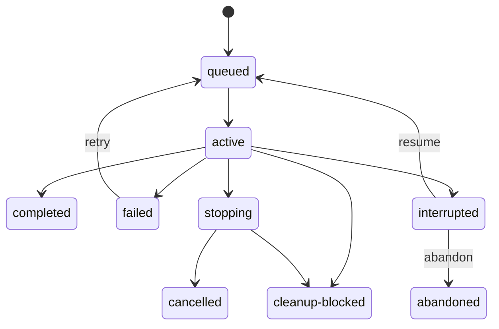

# Contracts

The examples in this document are design contracts, not implemented APIs.

## Delegation envelope

```ts
interface DelegatedTask {
	goal: string;
	context: string[];
	instructions: string[];
}
```

`goal` defines the required result, `context` carries bounded caller-supplied
facts, and `instructions` defines task-specific actions. Transcript inheritance
uses a separate `ContextMode`; it is never implicit.

## Identity hierarchy

```text
Owner
  Run
    Attempt
      Pi session
      Gondolin VM
      Workspace
```

```ts
type OwnerId = string;
type OperationId = string;
type RunId = string;
type AttemptId = string;
type SessionId = string;
type SandboxId = string;
type WorkspaceId = string;

interface SandboxIdentity {
	id: SandboxId;
	backend: "gondolin";
	gondolinVersion: string;
	imageIdentity: string;
	policySha256: string;
	capacityLeaseId: string;
	capacitySlot: number;
}
```

A VM belongs to one attempt and is never adopted by another attempt.
`OperationId` is chosen by the caller and makes logical launch idempotent across
concurrent seats and seat replacement. It does not keep an attempt alive after
its owning seat exits.

## Request and preflight

```ts
interface SubagentRequest {
	operationId: OperationId;
	agent: AgentSelector;
	agentRoots?: string[]; // absolute; at most 8
	task: DelegatedTask;
	contextMode: "fresh" | "fork";
	model?: ExactModelRequest;
	tools?: string[];
	preloadSkills?: string[];
	contextScopes: Array<"global" | "project">;
	workspace: WorkspaceRequest;
	ceiling?: DelegationCeiling;
	memoryBytes?: number;
	outputSchema?: JsonSchema;
	limits: RunLimits;
}

interface DelegationCeiling {
	workspaceModes?: Array<"read-only" | "worktree">; // at least one
	tools?: string[];                                 // at most 64
}

type WorkspaceRequest =
	| { mode: "read-only"; cwd: string }
	| { mode: "worktree"; cwd: string };

interface RunLimits {
	cumulativeRuntimeMs: number; // cumulative across every attempt
	attemptTimeoutMs: number;    // wall deadline for one attempt
	totalTokens?: number;        // optional all-traffic guard
	cost: number;                // provider-reported dollars
	outputBytes: number;
	workspaceWriteBytes: number;
	retries: number;
	resumes: number;
}

interface SubagentPreflight {
	preflightId: string;
	launchPlan: AgentLaunchPlan;
	warnings: PreflightWarning[];
}

interface MutationContext {
	operationId: OperationId;
	callerFence?: { scope: string; generation: number };
}

interface OwnerRegistration {
	id: OwnerId;
	parentSessionId?: string;
	parentSessionFile?: string;
	workflowRunId?: string;
	resultDestination?: string;
}
```

`agentRoots` lets an owner that ships agent definitions with its own package
name the directories holding them. Each entry must be absolute; a relative entry
fails preflight with `agent root must be absolute`. A definition's own templates
win: the roots resolve first and the service's own discovery only fills a name
no root defines, so a global or trusted-project definition of the same name
cannot shadow a shipped one, and a name no source defines still fails with
`agent not found: <name>`. Roots are read as one `package`-scope source set, so
two roots that define the same name are refused with
`duplicate agent in scope: package:<name>` rather than silently ordered. A
definition resolved from a request root loads under `package` scope and is
bound into the launch plan by canonical path and digest exactly like any other
definition: the launch plan and its `agent` resource grant name the root's file,
and the launch re-resolves it and rejects a definition that changed after
preflight. A root that does not exist contributes nothing. There is no way to
customize a shipped definition by defining a project or global agent of the same
name.

`ceiling` is a bound the host puts on one delegation, stated in this runtime's
own vocabulary: workspace modes and tool names, never a host's own mode names.
The launch's effective allowance is the agent definition's declared allowance
intersected with the ceiling, so a ceiling only ever narrows. An absent
`ceiling`, or an absent sub-field, is no bound on that axis. Preflight refuses by
name: a requested mode the host does not allow fails with
`workspace mode exceeds host ceiling: worktree (host allows read-only)`, and a
requested tool outside the ceiling fails with `tool exceeds host ceiling: write`.
The ceiling that applied is recorded in the launch plan, sorted, and is part of
the launch identity digest and the persisted run and attempt records.

`cost` is provider-reported spend in dollars using Pi's configured model pricing
and message usage. A model configured with zero rates is treated as free; the
current Pi model contract does not distinguish free pricing from unavailable
pricing metadata. The service defaults to a $100 maximum declared task cost and
embedders may configure that policy. The task's
explicit cost limit must fit both its agent ceiling and the service policy.
`totalTokens` is optional; when absent, cost and runtime remain the task budget
authorities.

`memoryBytes` is the guest VM memory grant. It is a positive integer multiple of
64 MiB, at most 4 GiB. An agent definition declares the ceiling; a request may
only narrow it. When the request omits it, the plan uses the agent ceiling; when
the agent definition omits it, the ceiling is 512 MiB. A request above the
ceiling fails preflight with `memory request exceeds agent ceiling`. Guest CPU
count is fixed at one and is not a per-agent knob.

Preflight resolves and hashes all effective resources without starting a model
session or VM. Project trust, provenance, canonical paths, symlink policy,
public-egress policy, sandbox image, and caller operation identity are part of
the plan.

The initial release does not accept arbitrary child extensions. A capability
implemented by trusted host code must be declared through a pi-subagent-owned
adapter and represented in the launch identity.

## Agent definition frontmatter

```yaml
name: reviewer
model:
  provider: github-copilot
  id: gpt-5.6-luna
  thinking: low
tools: [read, grep]
preloadSkills: []
contextScopes: [project]
workspaceModes: [read-only]
memoryBytes: 2147483648   # optional; default 512 MiB, maximum 4 GiB
limits:
  cumulativeRuntimeMs: 600000
  attemptTimeoutMs: 300000
  cost: 10
  outputBytes: 1048576
  workspaceWriteBytes: 0
  retries: 1
  resumes: 1
```

Frontmatter is strict: unknown keys, a `memoryBytes` that is not a positive
integer multiple of 64 MiB, and a `memoryBytes` above 4 GiB are rejected at
discovery. Every declared value is a ceiling, never a floor.

## Effective launch plan

```ts
interface AgentLaunchPlan {
	schema: "pi-subagent-launch";
	contractRevision: number;
	operationId: OperationId;
	owner: OwnerGrant;
	runId: RunId;
	attemptId: AttemptId;
	agent: ResolvedAgentDefinition;
	task: DelegatedTask;
	context: ResolvedContextProjection;
	model: { provider: string; id: string; thinking: string };
	cwd: "/workspace";
	tools: ToolGrant[];
	preloadSkills: string[];
	skillCatalog: SkillGrant[];
	contextScopes: Array<"global" | "project">;
	contextFiles: ContextFileGrant[];
	forkContext?: ForkContextGrant;
	workspace: WorkspaceGrant;
	ceiling?: DelegationCeiling;
	sandbox: GondolinGrant;
	network: NetworkGrant;
	outputSchema?: JsonSchema;
	limits: RunLimits;
	projectTrust?: ProjectTrustReceipt;
	identitySha256: string;
}

interface GondolinGrant {
	backend: "gondolin";
	packageVersion: string;
	imageIdentity: string;
	mountPolicySha256: string;
	networkPolicySha256: string;
	memoryBytes: number;
	guestDiskBytes: number;
	workspaceWriteBytes: number;
	capacityPolicySha256: string;
}

interface NetworkGrant {
	mode: "public-egress";
	blockInternalRanges: true;
}
```

Agent-required and request-selected `contextScopes` are unioned. `global`
projects the Pi agent-directory context file; `project` projects Pi's normal
ancestor context chain only after project trust succeeds. Files are bounded,
digest-bound, injected through Pi's context-file mechanism, and exposed through
synthetic read-only guest `/context` mounts. Repository context symlinks may not
escape the selected checkout. Transcript inheritance remains separately
controlled by `contextMode`.

`ceiling` records the host bound the plan was compiled under, present only when
the request carried one. A launch plan without it was compiled with no host
bound.

`sandbox.memoryBytes` is the resolved per-run memory grant, so it is part of the
launch identity digest and of the persisted run and attempt records. Host VM
capacity stays slot-counted: host memory exposure is `maxSlots` x the per-run
grant, which for the default four slots and the 4 GiB ceiling is 16 GiB. There
is no separate total-memory budget; slots are held by OS-owned localhost
listeners and a byte budget would require durable fenced per-slot accounting
that the listener scheme does not provide.

Resource grants include canonical path, source provenance, content/tree digest,
and classification. Referenced resources and sandbox capabilities are
revalidated immediately before launch. The plan is immutable after launch
authority is committed.

## Service

```ts
interface SubagentService {
	readonly contract: SubagentRuntimeContract;
	forOwner(owner: OwnerRegistration): SubagentClient;
	listRuns(query?: RunQuery): Promise<RunPage>;
	inspectRun(runId: RunId): Promise<RunInspection>;
	runLogs(runId: RunId, options?: LogOptions): Promise<RunLogPage>;
	subscribe(listener: (event: RunObservation) => void): () => void;
	prune(options?: PruneOptions): Promise<RetentionReport>;
}

interface SubagentClient {
	preflight(request: SubagentRequest): Promise<SubagentPreflight>;
	launch(
		context: MutationContext,
		preflightId: string,
		expectedIdentitySha256: string,
	): Promise<RunReceipt>;
	findByOperation(operationId: OperationId): Promise<RunReceipt | undefined>;
	listRuns(query?: OwnerRunQuery): Promise<RunPage>;
	status(runId: RunId): Promise<RunStatus>;
	logs(runId: RunId, options?: LogOptions): Promise<RunLogPage>;
	wait(runId: RunId, options?: WaitOptions): Promise<RunResult>;
	steer(
		context: MutationContext,
		runId: RunId,
		input: ControlInput,
	): Promise<ControlReceipt>;
	followUp(
		context: MutationContext,
		runId: RunId,
		input: ControlInput,
	): Promise<ControlReceipt>;
	interrupt(
		context: MutationContext,
		runId: RunId,
		reason: StopReason,
	): Promise<InterruptReceipt>;
	retry(
		context: MutationContext,
		runId: RunId,
		policy?: RetryPolicy,
	): Promise<RunReceipt>;
	resume(
		context: MutationContext,
		runId: RunId,
		input?: ResumeInput,
	): Promise<RunReceipt>;
	reconcile(
		context: MutationContext,
		runId: RunId,
	): Promise<ReconcileResult>;
	exportArtifact(
		runId: RunId,
		artifact: ArtifactRef,
		maxBytes?: number,
	): Promise<ArtifactExport>;
	exportHandoff(
		runId: RunId,
		options?: { maxBytes?: number },
	): Promise<HandoffExport>;
	release(
		context: MutationContext,
		runId: RunId,
	): Promise<CleanupReceipt>;
	abandon(context: MutationContext, runId: RunId): Promise<RunReceipt>;
	pin(runId: RunId, reason: string): Promise<RetentionPin>;
	unpin(runId: RunId): Promise<boolean>;
}
```

`forOwner` returns an opaque client bound to one trusted extension owner; model
input cannot choose or impersonate an owner. This is authorization within the
trusted seat process, not a boundary against arbitrary installed extensions.
Run IDs are not bearer authorization.

`launch` consumes one exact unexpired preflight identity. It creates the native
session and VM in the current seat. It does not create detached work. A seat
exit interrupts every active attempt. The next seat may call `resume`, which
creates a new attempt and VM after validation; it does not reconnect to the old
VM.

`prune` defaults to dry-run, reports age/budget selection and protected reasons,
and moves applied selections to recoverable trash under a cross-process
retention lease plus per-run fencing. Owner pins protect the complete linked run
graph. Active, interrupted, cleanup-blocked, pinned, and unreleased-worktree runs
are never ordinary prune candidates.

`exportArtifact` returns bounded verified bytes plus media type and digest so a
caller can import them into its own retention domain. `release` completes only
retained workspace cleanup through the owning service.

```ts
interface HandoffRef {
	runId: RunId;
	attemptId: AttemptId;
	baselineHead: string;
	handoffCommit: string;
	format: "git-format-patch";
	sha256: string;
	bytes: number;
	mediaType: "application/x-git-format-patch";
}

interface HandoffExport {
	ref: HandoffRef;
	content: Buffer;
}
```

`exportHandoff` returns the writing attempt's handoff as bounded bytes so a
consumer that must never read private branches, refs, or host paths can import
workflow-owned evidence. The content is the binary-safe
`git format-patch --binary --stdout <baselineHead>..<handoffCommit>` output for
the single handoff commit, produced by the host with `--no-replace-objects` and
every `format.*` and `diff.*` rendering option pinned, without a diffstat or Git
version signature. Bytes and digest are identical for the same baseline/handoff
pair, the same Git build, and unchanged repository attributes: `.gitattributes`
content is part of the commit pair, and `.git/info/attributes` is treated as
part of the repository identity, so editing it changes the rendering. Consumers
verify `sha256` and `bytes`, then `git am` or `git apply --index` the patch onto
`baselineHead`. The handoff must be exactly one non-merge commit whose sole
parent is `baselineHead`; anything else is refused. Export is owner-scoped like
`exportArtifact`, requires a durable `completed`, `failed`, `cancelled`, or
`cleanup-blocked` result whose `handoff` carries a `handoffCommit`, holds the
run lease while reading the repository, and is bounded by `maxBytes` and the
absolute 64 MiB Git output cap. A run that changed nothing has no handoff commit
and is refused; an empty patch is never exported. Each export appends one
`handoff-exported` receipt carrying the `HandoffRef`. Release removes only the
reservation branch; the handoff commit stays reachable through a durable
`refs/pi-subagent/handoffs/<run-id>/<attempt-id>` ref until retention prunes the
run, so consumers may export before or after release but must export or pin
before the run becomes ordinary prune history. `abandon` permanently
terminalizes an interrupted run after sandbox cleanup is proved and any retained
workspace can be released safely. Cleanup-blocked runs must reconcile first.

The service owns one typed action projection consumed unchanged by the inspector
and direct commands:

| Run condition | Operator actions |
| --- | --- |
| active, controllable | steer, follow-up, stop |
| active, not controllable | stop |
| retry-eligible failed | retry plus terminal retention actions |
| interrupted | resume when eligible; abandon when sandbox and retained-workspace cleanup can be proved |
| cleanup-blocked | reconcile, plus release-workspace when the retained workspace is already proved releasable; export-handoff when a handoff commit exists |
| completed/failed/cancelled/abandoned | pin or unpin; export-output when present; export-handoff when a handoff commit exists (never for abandoned) |

Pin and unpin affect retention only. Operator surfaces do not offer them for
active, interrupted, or cleanup-blocked runs because those states are already
protected; trusted owner clients may still create a pin without changing
lifecycle state.

## Service provider

The extension registers one lazy provider on Pi's process-local event bus. A
trusted peer extension acquires the exact extension-owned service through the
`@vegardx/pi-subagent/service-provider` export and supplies its current
`ExtensionContext`:

```ts
interface SubagentServiceProvider {
	readonly contract: SubagentRuntimeContract;
	acquire(context: ExtensionContext): Promise<SubagentService>;
}
```

Discovery fails closed when the provider is absent, duplicated, or does not
match the current immutable runtime contract. Acquisition re-runs discovery
after the asynchronous provider call and rejects removal or replacement before
returning the service. Registration itself does not initialize the
model runtime, Gondolin assets, capacity manager, or service store. The
subagent extension alone owns provider removal and service shutdown. Consumers
must not cache the service across Pi session replacement or reload.

The event bus is an in-process composition mechanism among trusted extensions,
not an authorization boundary. Owner-bound clients still scope service access;
model input cannot access the provider API directly.

## Delegation ceiling provider

The model-facing `subagent` tool builds its own requests, so a host cannot put a
`ceiling` in them. A host registers one provider on the same process-local event
bus through the `@vegardx/pi-subagent/ceiling-provider` export:

```ts
type DelegationCeilingProvider = () => DelegationCeiling | undefined;

function registerDelegationCeilingProvider(
	events: EventBus,
	provider: DelegationCeilingProvider,
): () => void;
```

The tool consults the provider at every launch and attaches the answer as the
request's `ceiling`. Exactly one provider may be registered: a second
registration is refused with `A pi-subagent delegation ceiling provider is
already registered.` and leaves the first in place. No provider, or a provider
that answers with `undefined`, is no bound. Resolution fails closed on a ceiling
that violates the contract rather than launching unbounded. The host states the
bound in workspace modes and tool names; pi-subagent never learns the host's own
mode names.

## Control receipt

```ts
interface ControlReceipt {
	operationId: string;
	sequence: number;
	state: "accepted-by-session" | "missed" | "failed";
}
```

`accepted-by-session` does not claim that the model followed the input.
Duplicate operation IDs replay the prior receipt. There is no durable control
queue while the seat is absent.

## Runtime capability contract

```ts
interface SubagentRuntimeContract {
	schema: "pi-subagent-runtime";
	contractRevision: number;
	features: {
		nativeSessionBackend: boolean;
		gondolinSandbox: boolean;
		background: false;
		survivesSeatExit: false;
		steering: boolean;
		followUp: boolean;
		structuredOutput: boolean;
		preflight: boolean;
		idempotentLaunch: boolean;
		resume: boolean;
		classifiedFailures: boolean;
		cumulativeRuntimeBudget: boolean;
		costFirstBudgets: boolean;
		retryBackoff: boolean;
		deepReconciliation: boolean;
		worktrees: boolean;
		handoffExport: boolean;
		vmMemoryCeiling: boolean;
		workspaceBudgetRefusal: boolean;
		publicNetworkEgress: boolean;
		explicitResources: boolean;
		ambientExtensionsControl: boolean;
		hostBrokeredTools: boolean;
		agentRootsFirst: boolean;
		delegationCeiling: boolean;
	};
}
```

The current revision is 8. `handoffExport` states that `exportHandoff`,
`HandoffRef`, the `export-handoff` action, durable handoff refs, and the
`handoff-exported` receipt are implemented. `vmMemoryCeiling` states that agent
definitions carry an optional `memoryBytes` ceiling, that a request may narrow
it, and that the resolved value is bound into the launch plan and the sandbox
identity. `workspaceBudgetRefusal` states that an exhausted `workspaceWriteBytes`
budget refuses guest writes with `EDQUOT` and classifies the attempt failure as
`workspace-budget`. `agentRootsFirst` states that `SubagentRequest.agentRoots`
is accepted and that those roots resolve ahead of the service's own discovery;
a consumer that requires a discovered definition to shadow a shipped one must
refuse this runtime. `delegationCeiling` states that `SubagentRequest.ceiling`
bounds a launch in workspace modes and tool names, that the compiled launch plan
records the ceiling it applied, and that a host may register one ceiling provider
that the `subagent` tool consults at every launch. Revision 8 adds that recorded
`ceiling` to the persisted launch plan, so revision 7 state is not read.
Consumers check the exact contract
revision and required features rather than
infer support from package versions. Revisions are not backwards-compatible:
a consumer either supports the current revision or refuses to start. The
project does not provide compatibility aliases, adapters, or migration shims.

## Outcomes and states

```ts
type RunStatus =
	| "queued"
	| "active"
	| "stopping"
	| "completed"
	| "failed"
	| "cancelled"
	| "abandoned"
	| "interrupted"
	| "cleanup-blocked";

type AttemptStatus =
	| "preparing"
	| "running"
	| "settling"
	| "completed"
	| "failed"
	| "cancelled"
	| "interrupted";

type CleanupOutcome =
	| "proved"
	| "not-needed"
	| "retained"
	| "blocked"
	| "unknown";
```

A run aggregates attempts. Retry and resume terminate the prior attempt and
create a new one. Any post-side-effect path enters settlement before the run can
be terminal.

Completed results have no failure. Every failed, cancelled, abandoned,
interrupted, or cleanup-blocked result has exactly one bounded
`ClassifiedFailure`. Abandonment uses `operator-abandoned`, operator origin, and
retry `never`:

```ts
interface ClassifiedFailure {
	code: FailureCode;
	origin:
		| "model"
		| "operator"
		| "persistence"
		| "provider"
		| "sandbox"
		| "service"
		| "tool"
		| "workspace";
	retry: "never" | "manual" | "backoff" | "resume" | "reconcile";
	message: string;
	guidance: string;
	retryAfterMs?: number;
}
```

Unknown failures fail closed to `reconcile`. Explicit retry accepts only `manual`
or elapsed `backoff`; resume accepts only `resume`. Every attempt records
measured `runtimeMs`, and retry/resume subtract runtime, configured total model
tokens, and provider-reported cost from the current remaining plan before
creating a fresh attempt. When `totalTokens` is configured, it consumes the
reported `Usage.totalTokens`, including input, output, cache-read, and cache-write
traffic. Without it, cost and runtime remain authoritative.

A run may be `completed` only when VM cleanup is proved and workspace cleanup is
`proved` or `not-needed`. A deliberately retained worktree is represented as
`retained` and leaves the run `cleanup-blocked` until explicit `release` proves
cleanup. Blocked, retained, or unknown cleanup can never accompany `completed`.



## Result

```ts
interface RunResult {
	runId: RunId;
	status:
		| "completed"
		| "failed"
		| "cancelled"
		| "abandoned"
		| "interrupted"
		| "cleanup-blocked";
	output?: ArtifactRef;
	structuredOutput?: unknown;
	usage: Usage;
	usageComplete: boolean;
	runtimeMs: number;
	failure?: ClassifiedFailure;
	sandboxCleanup: CleanupOutcome;
	workspaceCleanup: CleanupOutcome;
	truncated: boolean;
}
```

Limits define per-attempt timeout, cumulative runtime, optional total model
tokens, provider-reported dollar cost, output, logs, events, artifact bytes,
retries, and resume count. At 70% and 90% of configured total-token,
provider-reported cost, cumulative-runtime, or attempt-timeout pressure, the
runtime persists a single stage receipt per attempt and queues progressively
stronger convergence steering. One unified stage per attempt prevents competing
budget dimensions from emitting duplicate notices.
Runtime stages are scheduled by wall clock; token stages are evaluated after
turn usage is recorded. Partial usage and truncation remain visible after
failure.
