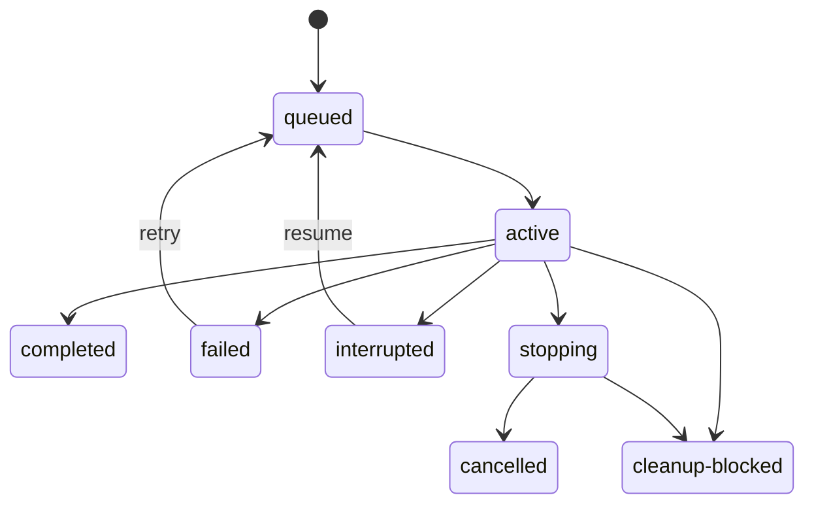

# Contracts

The examples in this document are design contracts, not implemented APIs.

## Delegation envelope

```ts
interface DelegatedTask {
	goal: string;
	context: string[];
	instructions: string[];
}
```

`goal` defines the required result, `context` carries bounded caller-supplied
facts, and `instructions` defines task-specific actions. Transcript inheritance
uses a separate `ContextMode`; it is never implicit.

## Identity hierarchy

```text
Owner
  Run
    Attempt
      Pi session
      Gondolin VM
      Workspace
```

```ts
type OwnerId = string;
type OperationId = string;
type RunId = string;
type AttemptId = string;
type SessionId = string;
type SandboxId = string;
type WorkspaceId = string;

interface SandboxIdentity {
	id: SandboxId;
	backend: "gondolin";
	gondolinVersion: string;
	imageIdentity: string;
	policySha256: string;
	capacityLeaseId: string;
	capacitySlot: number;
}
```

A VM belongs to one attempt and is never adopted by another attempt.
`OperationId` is chosen by the caller and makes logical launch idempotent across
concurrent seats and seat replacement. It does not keep an attempt alive after
its owning seat exits.

## Request and preflight

```ts
interface SubagentRequest {
	operationId: OperationId;
	agent: AgentSelector;
	task: DelegatedTask;
	contextMode: "fresh" | "fork";
	model?: ExactModelRequest;
	tools?: string[];
	skills?: string[];
	workspace: WorkspaceRequest;
	outputSchema?: JsonSchema;
	limits: RunLimits;
}

type WorkspaceRequest =
	| { mode: "read-only"; cwd: string }
	| { mode: "worktree"; cwd: string };

interface SubagentPreflight {
	preflightId: string;
	launchPlan: AgentLaunchPlan;
	warnings: PreflightWarning[];
}

interface MutationContext {
	operationId: OperationId;
	callerFence?: { scope: string; generation: number };
}

interface OwnerRegistration {
	id: OwnerId;
	parentSessionId?: string;
	workflowRunId?: string;
	resultDestination?: string;
}
```

Preflight resolves and hashes all effective resources without starting a model
session or VM. Project trust, provenance, canonical paths, symlink policy,
public-egress policy, sandbox image, and caller operation identity are part of
the plan.

The initial release does not accept arbitrary child extensions. A capability
implemented by trusted host code must be declared through a pi-subagent-owned
adapter and represented in the launch identity.

## Effective launch plan

```ts
interface AgentLaunchPlan {
	schema: "pi-subagent-launch";
	contractRevision: number;
	operationId: OperationId;
	owner: OwnerGrant;
	runId: RunId;
	attemptId: AttemptId;
	agent: ResolvedAgentDefinition;
	task: DelegatedTask;
	context: ResolvedContextProjection;
	model: { provider: string; id: string; thinking: string };
	cwd: "/workspace";
	tools: ToolGrant[];
	skills: SkillGrant[];
	workspace: WorkspaceGrant;
	sandbox: GondolinGrant;
	network: NetworkGrant;
	outputSchema?: JsonSchema;
	limits: RunLimits;
	projectTrust?: ProjectTrustReceipt;
	identitySha256: string;
}

interface GondolinGrant {
	backend: "gondolin";
	packageVersion: string;
	imageIdentity: string;
	mountPolicySha256: string;
	networkPolicySha256: string;
	memoryBytes: number;
	guestDiskBytes: number;
	workspaceWriteBytes: number;
	capacityPolicySha256: string;
}

interface NetworkGrant {
	mode: "public-egress";
	blockInternalRanges: true;
}
```

Resource grants include canonical path, source provenance, content/tree digest,
and classification. Referenced resources and sandbox capabilities are
revalidated immediately before launch. The plan is immutable after launch
authority is committed.

## Service

```ts
interface SubagentService {
	readonly contract: SubagentRuntimeContract;
	forOwner(owner: OwnerRegistration): SubagentClient;
}

interface SubagentClient {
	preflight(request: SubagentRequest): Promise<SubagentPreflight>;
	launch(
		context: MutationContext,
		preflightId: string,
		expectedIdentitySha256: string,
	): Promise<RunReceipt>;
	findByOperation(operationId: OperationId): Promise<RunReceipt | undefined>;
	status(runId: RunId): Promise<RunStatus>;
	logs(runId: RunId, options?: LogOptions): Promise<RunLogs>;
	wait(runId: RunId, options?: WaitOptions): Promise<RunResult>;
	steer(
		context: MutationContext,
		runId: RunId,
		input: ControlInput,
	): Promise<ControlReceipt>;
	followUp(
		context: MutationContext,
		runId: RunId,
		input: ControlInput,
	): Promise<ControlReceipt>;
	interrupt(
		context: MutationContext,
		runId: RunId,
		reason: StopReason,
	): Promise<InterruptReceipt>;
	retry(
		context: MutationContext,
		runId: RunId,
		policy?: RetryPolicy,
	): Promise<RunReceipt>;
	resume(
		context: MutationContext,
		runId: RunId,
		input?: ResumeInput,
	): Promise<RunReceipt>;
	reconcile(
		context: MutationContext,
		runId: RunId,
	): Promise<ReconcileResult>;
	exportArtifact(artifact: ArtifactRef): Promise<ArtifactExport>;
	release(
		context: MutationContext,
		runId: RunId,
	): Promise<CleanupReceipt>;
}
```

`forOwner` returns an opaque client bound to one trusted extension owner; model
input cannot choose or impersonate an owner. This is authorization within the
trusted seat process, not a boundary against arbitrary installed extensions.
Run IDs are not bearer authorization.

`launch` consumes one exact unexpired preflight identity. It creates the native
session and VM in the current seat. It does not create detached work. A seat
exit interrupts every active attempt. The next seat may call `resume`, which
creates a new attempt and VM after validation; it does not reconnect to the old
VM.

`exportArtifact` returns bounded verified bytes plus media type and digest so a
caller can import them into its own retention domain. `release` completes
retained workspace cleanup through the owning service.

## Control receipt

```ts
interface ControlReceipt {
	operationId: string;
	sequence: number;
	state: "accepted-by-session" | "missed" | "failed";
}
```

`accepted-by-session` does not claim that the model followed the input.
Duplicate operation IDs replay the prior receipt. There is no durable control
queue while the seat is absent.

## Runtime capability contract

```ts
interface SubagentRuntimeContract {
	schema: "pi-subagent-runtime";
	contractRevision: number;
	features: {
		nativeSessionBackend: boolean;
		gondolinSandbox: boolean;
		background: false;
		survivesSeatExit: false;
		steering: boolean;
		followUp: boolean;
		structuredOutput: boolean;
		preflight: boolean;
		idempotentLaunch: boolean;
		resume: boolean;
		worktrees: boolean;
		publicNetworkEgress: boolean;
		explicitResources: boolean;
		ambientExtensionsControl: boolean;
	};
}
```

Consumers check the exact contract revision and required features rather than
infer support from package versions. Revisions are not backwards-compatible:
a consumer either supports the current revision or refuses to start. The
project does not provide compatibility aliases, adapters, or migration shims.

## Outcomes and states

```ts
type RunStatus =
	| "queued"
	| "active"
	| "stopping"
	| "completed"
	| "failed"
	| "cancelled"
	| "interrupted"
	| "cleanup-blocked";

type AttemptStatus =
	| "preparing"
	| "running"
	| "settling"
	| "completed"
	| "failed"
	| "cancelled"
	| "interrupted";

type CleanupOutcome =
	| "proved"
	| "not-needed"
	| "retained"
	| "blocked"
	| "unknown";
```

A run aggregates attempts. Retry and resume terminate the prior attempt and
create a new one. Any post-side-effect path enters settlement before the run can
be terminal.

A run may be `completed` only when VM cleanup is proved and workspace cleanup is
`proved` or `not-needed`. A deliberately retained worktree is represented as
`retained` and leaves the run `cleanup-blocked` until explicit `release` proves
cleanup. Blocked, retained, or unknown cleanup can never accompany `completed`.



## Result

```ts
interface RunResult {
	runId: RunId;
	status:
		| "completed"
		| "failed"
		| "cancelled"
		| "interrupted"
		| "cleanup-blocked";
	output?: ArtifactRef;
	structuredOutput?: unknown;
	usage: Usage;
	usageComplete: boolean;
	failure?: ClassifiedFailure;
	sandboxCleanup: CleanupOutcome;
	workspaceCleanup: CleanupOutcome;
	truncated: boolean;
}
```

Limits define per-attempt and per-run runtime, tokens, cost, output, logs,
events, artifact bytes, retries, and resume count. Partial usage and truncation
remain visible after failure.
