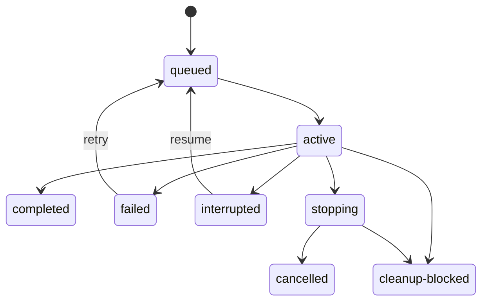

# Contracts

The examples in this document are design contracts, not implemented APIs.

## Delegation envelope

```ts
interface DelegatedTask {
	goal: string;
	context: string[];
	instructions: string[];
}
```

`goal` defines the required result, `context` carries bounded caller-supplied
facts, and `instructions` defines task-specific actions. Transcript inheritance
uses a separate `ContextMode`; it is never implicit.

## Identity hierarchy

```text
Owner
  Run
    Attempt
      Pi session
      OS process
      Workspace
```

```ts
type OwnerId = string;
type OperationId = string;
type RunId = string;
type AttemptId = string;
type SessionId = string;
type WorkspaceId = string;

interface ProcessIdentity {
	pid: number;
	processGroupId?: number;
	birthIdentity: string;
}
```

`OperationId` is chosen by the caller and makes launch idempotent across a crash
between child startup and receipt persistence.

## Request and preflight

```ts
interface SubagentRequest {
	operationId: OperationId;
	owner: {
		id: OwnerId;
		parentSessionId?: string;
		workflowRunId?: string;
		workflowTaskId?: string;
	};
	agent: AgentSelector;
	task: DelegatedTask;
	contextMode: "fresh" | "fork";
	model?: ExactModelRequest;
	tools?: string[];
	extensions?: string[];
	skills?: string[];
	workspace: WorkspaceRequest;
	execution: "foreground" | "background";
	outputSchema?: JsonSchema;
	limits: RunLimits;
}

interface SubagentPreflight {
	preflightId: string;
	launchPlan: AgentLaunchPlan;
	warnings: PreflightWarning[];
}

interface MutationContext {
	owner: OwnerId;
	operationId: OperationId;
	callerFence?: { scope: string; generation: number };
}
```

Preflight resolves and hashes all effective resources without starting a child.
Project trust, provenance, content digests, canonical paths, symlink policy, and
the caller's operation identity are part of the plan.

## Effective launch plan

```ts
interface AgentLaunchPlan {
	schema: "pi-subagent-launch-v1";
	operationId: OperationId;
	owner: OwnerGrant;
	runId: RunId;
	attemptId: AttemptId;
	agent: ResolvedAgentDefinition;
	task: DelegatedTask;
	context: ResolvedContextProjection;
	model: { provider: string; id: string; thinking: string };
	cwd: string;
	tools: ToolGrant[];
	extensions: ExtensionGrant[];
	skills: SkillGrant[];
	workspace: WorkspaceGrant;
	outputSchema?: JsonSchema;
	limits: RunLimits;
	projectTrust?: ProjectTrustReceipt;
	identitySha256: string;
}
```

Resource grants include canonical path, source provenance, content/tree digest,
and classification. Referenced resources are revalidated immediately before
child release. The plan is immutable after launch authority is committed.

## Service

```ts
interface SubagentServiceV1 {
	readonly contract: SubagentRuntimeContractV1;
	preflight(request: SubagentRequest): Promise<SubagentPreflight>;
	launch(context: MutationContext, preflightId: string, expectedIdentitySha256: string): Promise<RunReceipt>;
	findByOperation(owner: OwnerId, operationId: OperationId): Promise<RunReceipt | undefined>;
	status(owner: OwnerId, runId: RunId): Promise<RunStatus>;
	logs(owner: OwnerId, runId: RunId, options?: LogOptions): Promise<RunLogs>;
	wait(owner: OwnerId, runId: RunId, options?: WaitOptions): Promise<RunResult>;
	steer(context: MutationContext, runId: RunId, input: ControlInput): Promise<ControlReceipt>;
	followUp(context: MutationContext, runId: RunId, input: ControlInput): Promise<ControlReceipt>;
	interrupt(context: MutationContext, runId: RunId, reason: StopReason): Promise<InterruptReceipt>;
	retry(context: MutationContext, runId: RunId, policy?: RetryPolicy): Promise<RunReceipt>;
	resume(context: MutationContext, runId: RunId, input?: ResumeInput): Promise<RunReceipt>;
	reconcile(context: MutationContext, runId: RunId): Promise<ReconcileResult>;
	exportArtifact(owner: OwnerId, artifact: ArtifactRef): Promise<ArtifactExport>;
	release(context: MutationContext, runId: RunId): Promise<CleanupReceipt>;
}
```

Every mutating operation carries a caller-chosen idempotency key. A workflow
owner also supplies its current fencing generation; the service records the
highest accepted generation per owner scope and rejects stale mutations.
`launch` succeeds only for the exact unexpired preflight identity and consumes
its launch authority once. Run IDs are not bearer authorization; owner identity
is checked for every operation. Result delivery destinations are persisted and
inactive destinations retain bounded receipts for later collection.

`exportArtifact` returns bounded verified bytes plus media type and digest so a
caller can import them into its own retention domain. `release` retries or
completes retained workspace/process cleanup through the owning service.

## Control receipt

```ts
interface ControlReceipt {
	operationId: string;
	sequence: number;
	state: "persisted" | "accepted-by-session" | "missed" | "failed";
}
```

`accepted-by-session` does not claim that the model followed the input.
Duplicate operation IDs replay the prior receipt.

## Runtime capability contract

```ts
interface SubagentRuntimeContractV1 {
	schema: "pi-subagent-runtime-v1";
	apiVersion: 1;
	features: {
		rpcBackend: boolean;
		background: boolean;
		steering: boolean;
		followUp: boolean;
		structuredOutput: boolean;
		preflight: boolean;
		idempotentLaunch: boolean;
		resume: boolean;
		worktrees: boolean;
		sandbox: boolean;
		explicitExtensions: boolean;
		ambientExtensionsControl: boolean;
	};
}
```

Consumers check required features, not inferred package versions.

## Outcomes and states

```ts
type RunStatus =
	| "queued"
	| "active"
	| "stopping"
	| "completed"
	| "failed"
	| "cancelled"
	| "interrupted"
	| "cleanup-blocked";

type AttemptStatus =
	| "preparing"
	| "launching"
	| "running"
	| "settling"
	| "completed"
	| "failed"
	| "cancelled"
	| "interrupted";

type CleanupOutcome = "proved" | "not-needed" | "retained" | "blocked" | "unknown";
```

A run aggregates attempts. Retry and resume terminate the prior attempt and
create a new one. Any post-side-effect path enters settlement before the run can
be terminal.

A run may be `completed` only when required process and workspace cleanup are
`proved` or `not-needed`. `retained`, `blocked`, or `unknown` produces
`cleanup-blocked` until an explicit `release` operation proves cleanup.



## Result

```ts
interface RunResult {
	runId: RunId;
	status: "completed" | "failed" | "cancelled" | "interrupted" | "cleanup-blocked";
	output?: ArtifactRef;
	structuredOutput?: unknown;
	usage: Usage;
	failure?: ClassifiedFailure;
	processCleanup: CleanupOutcome;
	workspaceCleanup: CleanupOutcome;
	truncated: boolean;
}
```

Limits define per-attempt and per-run runtime, tokens, cost, output, logs,
events, artifact bytes, retries, and resume count. Partial usage and truncation
remain visible after failure.
