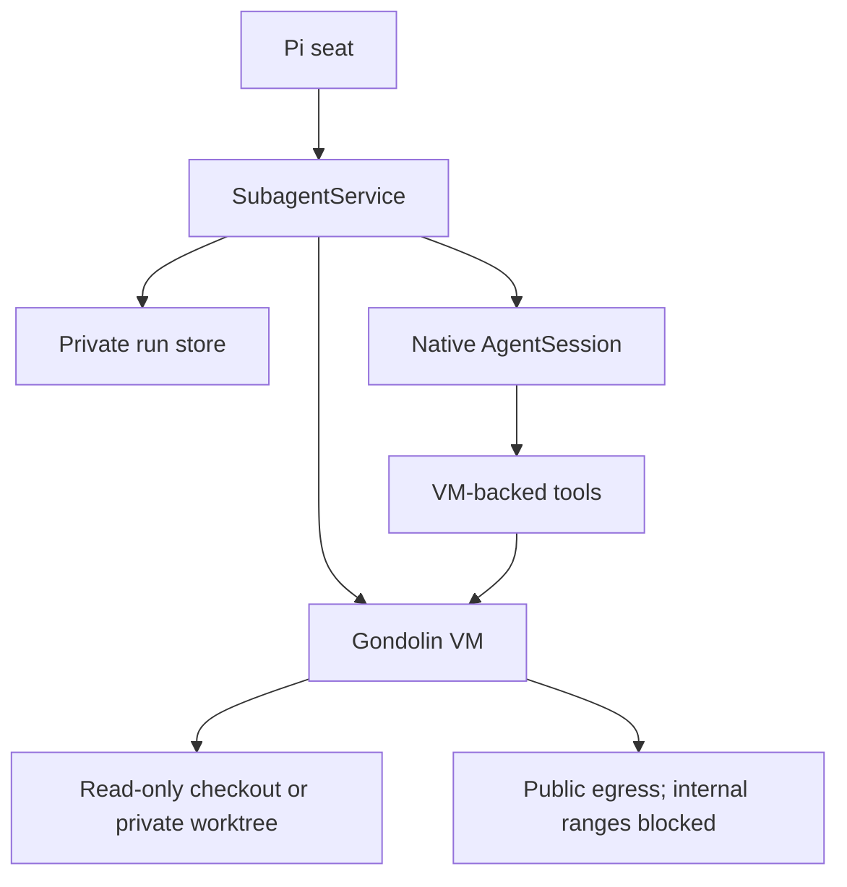
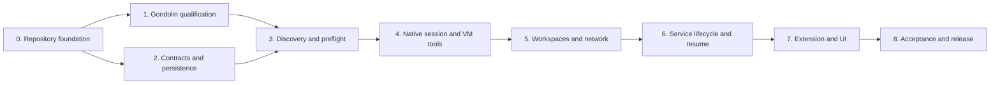

# Implementation plan

## Target

The first stable release targets Pi `>=0.84.2 <0.85`, Node.js 23.6 or newer,
and qualified Gondolin/QEMU combinations on macOS Apple Silicon. New Pi, Node,
Gondolin, image, QEMU, macOS, or architecture versions require explicit
qualification. Linux and macOS Intel are not supported hosts.

The current Gondolin qualification candidate is
`@earendil-works/gondolin` 0.12.0. Production code pins the exact version and
image identity that pass the qualification gate.

The stable core includes:

- native in-process Pi `AgentSession`s;
- one Gondolin VM per active attempt;
- explicit resource projection with no ambient child extensions;
- VM-backed `read`, `write`, `edit`, `bash`, `grep`, `find`, and `ls` tools;
- read-only checkout mounts and private worktrees;
- public internet access with host/local/internal ranges blocked;
- exact agent/model/resource/sandbox preflight;
- structured output, bounded artifacts, and usage;
- status, logs, wait, steering, follow-up, and stop while the seat is active;
- retry and persisted-session resume into a fresh VM;
- fail-closed VM, workspace, and handoff cleanup;
- a public `SubagentService` and thin Pi extension.

It does not include:

- child Pi RPC processes;
- detached/background execution;
- survival of active work across seat exit;
- VM pooling or sharing;
- arbitrary child extension loading;
- recursive subagents;
- per-agent network allowlists or dynamic network approval;
- direct access to host, local-network, or metadata services;
- guest-owned Git worktree, commit, or cleanup operations;
- workflow scheduling, publication, or PR policy.

## Runtime shape



`preflight` resolves an immutable launch identity without starting a model
session or VM. `launch` creates both in the current seat. Foreground behavior is
`launch` followed by `wait`; callers may observe an active run asynchronously
only while the owning seat remains alive.

The service owns:

- run and attempt state;
- Pi session creation and persistence;
- Gondolin adapter and VM lifecycle;
- tool/resource projection;
- public-egress and internal-network protection;
- worktree preparation and handoff;
- cancellation and terminal evidence;
- retry, fresh-VM resume, and reconciliation;
- bounded output, usage, and artifacts.

## Candidate source layout

This is an ownership map. Begin with vertical slices and extract modules only
when a boundary has independent tests or reuse.

```text
src/
  index.ts
  extension.ts
  service.ts
  contract.ts
  schema.ts
  errors.ts
  ids.ts

  agents/
    definition.ts
    discovery.ts
    resolution.ts

  capabilities/
    registry.ts
    grants.ts
    projection.ts
    provenance.ts

  model/
    selection.ts
    auth.ts

  launch/
    request.ts
    preflight.ts
    plan.ts
    authority.ts

  session/
    create.ts
    resources.ts
    control.ts
    settlement.ts

  sandbox/
    adapter.ts
    capability.ts
    image.ts
    lifecycle.ts
    policy.ts
    terminal-proof.ts

  tools/
    registry.ts
    operations.ts
    paths.ts
    builtins.ts

  network/
    policy.ts
    audit.ts

  workspace/
    readonly.ts
    worktree.ts
    mounts.ts
    filters.ts
    handoff.ts
    cleanup.ts

  lifecycle/
    reducer.ts
    run.ts
    attempt.ts
    retry.ts
    resume.ts
    reconcile.ts
    failure.ts

  persistence/
    paths.ts
    events.ts
    snapshot.ts
    store.ts
    retention.ts

  artifacts/
    store.ts
    export.ts
    output.ts
    truncation.ts

  usage/
    accounting.ts

  ui/
    widget.ts
    inspector.ts

test/
  unit/
  component/
  integration/
  acceptance/
  fixtures/
```

## Deliverable graph



## Deliverable 0 — repository foundation

### Build

- npm package `@vegardx/pi-subagent`;
- strict TypeScript with NodeNext and explicit `.js` imports;
- Biome, Vitest, and TypeScript gates;
- GitHub Actions on the qualified macOS runner plus Ubuntu build-portability
  coverage that does not imply runtime support;
- Pi package manifest with one extension entry;
- public exports for the service contract and extension;
- Pi core packages as peer dependencies;
- packed-artifact validation.

### Exit gate

- empty extension loads in a clean `PI_CODING_AGENT_DIR`;
- package contains only intended files;
- format, typecheck, unit, package, and smoke gates pass;
- API and package manifest are checked mechanically.

## Deliverable 1 — Gondolin qualification

This is a disposable spike, not production architecture hidden in a test.

The macOS arm64 drive is recorded in
[`docs/qualification/gondolin-darwin-arm64.md`](qualification/gondolin-darwin-arm64.md).
VM/tool/session isolation and the pi-subagent-owned cross-process VM-capacity
lease passed on the supported macOS Apple Silicon host. No Linux qualification
is planned.

### Build and measure

- capability probe for QEMU, acceleration, Node, and platform;
- boot pinned Gondolin 0.12.0 candidate assets;
- mount a disposable VFS workspace at `/workspace`;
- adapt Pi tool operations for `read`, `write`, `edit`, `bash`, `grep`, `find`,
  and `ls`;
- apply public-egress policy with internal-range blocking;
- run two native sessions in separate VMs;
- configure and probe VM memory/concurrency plus guest-overlay/workspace quotas;
- record image download, boot, memory, disk, command, cancellation, and shutdown
  measurements.

### Adversarial checks

- host home, Pi config, runtime store, and unrelated paths are absent;
- repository-local files, including `.env`, remain visible;
- traversal, absolute paths, and symlink escapes fail;
- read-only mounts reject writes;
- public internet works while redirected private, loopback, link-local, and
  metadata destinations fail;
- closing one VM cannot affect the other;
- bounded large-write, memory-allocation, fork-loop, and CPU-loop fixtures cannot
  exhaust the host before quota, cancellation, or timeout;
- cancellation leaves no VM process after bounded cleanup.

### Exit gate

Every qualification item in `docs/acceptance.md` passes with real QEMU. If not,
document the finding and reconsider the backend. Do not weaken the test or add a
host fallback.

## Deliverable 2 — contracts and persistence

The first pure slice defines the exact runtime capability schema, bounded result
shape, cleanup invariants, and exhaustive run-status transition reducer. The
persistence slice adds bounded sequenced JSONL events, fsync-backed atomic
snapshots, private modes, JSON-roundtrip checks, conservative torn-tail and
corruption handling, and an atomic owner-scoped operation idempotency index.
Cross-process run fencing with monotonic generations is implemented and enforced
by journal appends and snapshots. Session fencing remains outstanding. Worktree mutations and cleanup now require
a current matching run lease, and explicit release deletes a handoff branch only
after the worktree is gone and the branch still resolves to the recorded commit.
The host reserves deterministic per-attempt branches/worktrees, captures all
changes in an immutable commit, persists the handoff before cleanup, retains
dirty work, and removes only clean worktrees whose path, branch, and HEAD match
the recorded identity.
Strict package manifests now contribute contained package-scoped agent
directories with canonical manifest provenance; absolute, missing, non-directory,
duplicate, and package-escaping sources fail closed. Git workspace preflight now resolves canonical
repository/subdirectory identity, requires clean writing baselines, and binds
HEAD plus tracked diff, status, and untracked content for dirty read-only
reviews.
Agent discovery now parses bounded strict frontmatter, requires trusted project
sources, validates default-model ceilings, rejects same-scope collisions, and
applies deterministic builtin → package → global → project precedence. Exact Pi
model preflight now checks catalog identity, supported thinking levels, and
provider authentication through `ModelRuntime` without clamping or fallback.
Normal Pi global/package and trusted-project skills are discovered on the host,
tree-digested into launch identity, exposed through the standard child catalog,
and mounted read-only under guest `/skills` paths. Agent/request
`preloadSkills` content is bounded and injected before the first turn.
Canonical file and tree digesting now binds real paths, relative entry names,
content, executable mode, and bounded file/byte counts while rejecting symlinks
and unsupported entries. The semantic compiler enforces agent capability and limit ceilings, exact model
resolution, required and unrequested resource provenance, workspace resolution,
and deterministic canonical launch identity. Strict request and immutable
launch-plan schemas bind task, model, tools, skill catalog/preloads, workspace,
Gondolin/image/policy identities, public-egress policy, and limits. Every unimplemented runtime feature
remains `false`.

### Build

- branded owner, operation, run, attempt, session, sandbox, workspace, and
  artifact IDs;
- TypeBox schemas matching public TypeScript types;
- runtime capability contract stating `background: false` and
  `survivesSeatExit: false`;
- immutable launch plan including image, mount, and network policy digests;
- exhaustive run/attempt reducers;
- stable failure codes and retryability;
- private bounded run store and session paths;
- append-only sequenced events and atomic snapshots;
- durable operation idempotency index;
- cross-process run/session/worktree leases with process birth identity,
  monotonic fencing, and ordered lock acquisition;
- cross-process global VM-capacity accounting;
- bounded retention preserving interrupted and cleanup-blocked work.

### Tests

- schema/type parity and transition exhaustiveness;
- duplicate operation replay across concurrent seats;
- stale lease writers are fenced after conservative reclamation;
- global VM capacity cannot be exceeded by multiple seats;
- unknown versions and corrupt/torn state fail closed;
- serialization bounds and redaction;
- symlink, hardlink, ownership, and mode checks;
- completion requires VM and workspace terminal evidence.

### Exit gate

A deterministic fake adapter can reduce, persist, and recover every state
without claiming unobserved effects.

## Deliverable 3 — discovery and preflight

### Build

- builtin, user-global, trusted-project, and package-manifest agent discovery;
- deterministic precedence and collision diagnostics;
- self-contained delegated-task validation;
- explicit fresh/fork context mode;
- exact model/thinking resolution through Pi `ModelRuntime`;
- single-source tool declaration registry;
- explicit skill and context projection;
- workspace canonicalization and Git checks;
- Gondolin/QEMU/image capability probe;
- mount containment and public-egress policy compilation;
- immutable expiring preflight identity;
- no arbitrary extension grants.

### Tests

- source precedence and malformed definitions;
- project trust requirements;
- unavailable model/auth and sandbox capability failures;
- requests cannot exceed agent ceilings;
- tool schema, grant, implementation, and tests cannot drift;
- resource or policy mutation invalidates launch;
- ambient resources and credentials are absent from plans.

### Exit gate

Preflight resolves a complete immutable launch plan without starting a model
session, VM, or worktree.

## Deliverable 4 — native session and VM tools

The production Gondolin adapter now acquires global capacity before startup,
uses explicit QEMU with bounded memory/CPU/network settings, mounts either a
read-only or write-budgeted canonical workspace, exposes the promoted seven-tool
operation set, and releases capacity only after VM closure proves its host PID
gone. Cancellation closes the entire per-attempt VM. Native session service
integration now has a production foreground attempt runner: it verifies launch
identity and current ownership, resolves exact authenticated models, creates a
persistent isolated native session, enforces runtime/output/token/cost bounds,
closes the VM, captures worktree handoff, and persists terminal journal/snapshot
receipts. Foreground service orchestration and structured output are integrated;
normal skill discovery and forced startup preloads are integrated; explicit
context and fork projection remain outstanding.

### Build

- isolated `DefaultResourceLoader` configuration;
- persisted `SessionManager` and native `createAgentSession()` integration;
- one Gondolin adapter and VM per attempt;
- VM-backed built-in tool operations rooted at `/workspace`;
- path containment and bounded output;
- authoritative session settlement and usage collection;
- abort propagation from service to session and VM;
- VM closure receipt and QEMU process identity evidence;
- enforced VM concurrency, memory, guest-overlay, workspace-write, and output
  limits;
- strict structured output through a terminating final-answer capability.

### Tests

- no child Pi process starts;
- effective resources match preflight;
- every built-in operation crosses the VM adapter;
- startup failure before and after VM/session readiness;
- provider error, tool error, timeout, abort, and settlement races;
- structured output success, repair, and exhaustion;
- unknown VM terminal state becomes cleanup-blocked;
- quota and timeout failures remain contained and never fall back to host tools.

### Exit gate

One read-only foreground subagent can complete or fail with trustworthy session
and VM terminal evidence.

The artifact foundation now stores fenced immutable content-addressed blobs with
per-artifact and per-store limits, private modes, deduplication, media types,
SHA-256 verification, and bounded owner-scoped export. The runner stores bounded
full text output as an artifact while returning a 32 KiB inline projection.
Structured output now compiles bounded strict JSON schemas before launch,
exposes a terminating `final_answer` tool, validates and deep-copies one value,
and allows two bounded repair turns before failing. Accepted values are persisted
as `application/json` artifacts and terminal results. Retention pins, garbage
collection, and binary task artifacts remain outstanding.

## Deliverable 5 — workspaces and network

### Build

- filtered read-only active-checkout VFS;
- deterministic private worktree per writing attempt;
- subdirectory cwd mapping to `/workspace`;
- host-owned baseline and bounded setup;
- repository-local files visible without secret-path filtering;
- no runtime-store, home, Pi-config, or unrelated-repository mounts;
- immutable commit or artifact handoff;
- binary/mode/symlink/deletion-safe change capture;
- public-egress Gondolin network policy;
- internal-range and redirect enforcement;
- bounded network audit events.

### Tests

- requested isolation never falls back;
- parallel writers have separate VMs and worktrees;
- read-only writes fail;
- common Git metadata is not exposed unrestricted;
- patch/handoff fidelity covers binary, mode, symlink, rename, and deletion;
- cancellation preserves uncaptured work;
- public internet works while host and internal destinations remain blocked;
- repository-local content is explicitly outside confidentiality guarantees;
- workspace cleanup failure blocks success.

### Exit gate

Read-only and writing attempts have enforceable VM, workspace, and network
boundaries with verifiable handoff.

## Deliverable 6 — service lifecycle and resume

The standalone owner-bound foreground service now provides preflight, launch,
status, logs, wait, and interrupt. It deterministically derives run identity,
revalidates agent/model/workspace state at launch, claims the durable operation
index, acquires fenced run ownership, prepares worktrees, and delegates to the
production attempt runner. Duplicate launch in the live seat adopts the same
run. Startup now scans immutable run records, acquires replacement fencing, restores
terminal snapshots and artifact access, rebuilds owner/status/wait routing, and
adopts durable operation IDs. Runs without proved terminal snapshots are
conservatively rewritten as cleanup-blocked. Active observation of runs still owned by another seat remains outstanding.
Active runs now register direct native-session steering and follow-up controls.
Owner-scoped control operation IDs are durable, delivery is serialized, duplicate
requests replay one receipt, and outcomes distinguish accepted-by-session,
missed, and failed without claiming model compliance. Owner-triggered
reconciliation reacquires fencing, inspects persisted VM PID
and worktree evidence without signaling unknown processes, and moves stale runs
to failed, interrupted, or cleanup-blocked with a new durable receipt. Immutable per-attempt records now preserve ordinal, kind, parent, plan, and
worktree identity across initial/retry/resume execution. Failed runs can retry
with a new attempt while decrementing remaining retry/token/cost budgets.
Interrupted runs can reopen a contained persisted Pi session in a fresh VM while
decrementing resume/token/cost budgets and reusing a retained worktree when
present. Deeper VM session-registry reconciliation, retry backoff/classification,
retention remains outstanding. Owner-bound release now reacquires fencing,
removes every recorded clean worktree without force, deletes only branches that
still resolve to their baseline/handoff commit, updates cleanup state, and is
idempotent. Dirty or identity-mismatched work is retained.

### Build

- `createSubagentService()` and opaque owner-bound clients;
- idempotent preflight/launch and operation lookup;
- `status`, `logs`, `wait`, `steer`, `followUp`, and `interrupt` while active;
- retry budgets and attempt history;
- graceful seat shutdown/reload interruption;
- fenced cross-seat ownership and conservative stale-lease reclamation;
- persisted Pi session resume into a fresh VM only after prior VM termination;
- reconciliation of stale session, VM, worktree, handoff, and terminal records;
- bounded artifact export and exact usage completeness;
- explicit release of retained workspaces.

### Tests

- concurrent duplicate launch from separate seats starts one session and VM;
- owner clients cannot access each other's runs;
- a live owning seat prevents another seat from resuming or releasing its run;
- cancellation races with completion;
- graceful seat exit interrupts and closes VMs;
- stale active state never becomes success;
- resume validates authority/workspace and creates a fresh VM only after the
  prior seat and VM are proved terminal;
- no live VM or guest process is adopted or allowed to share a worktree;
- retry/resume preserve limits, cost, and evidence;
- inactive-seat control is rejected rather than durably queued.

### Exit gate

The standalone service supports production foreground execution and
fresh-VM recovery without the Pi extension adapter.

## Deliverable 7 — Pi extension and UI

The package extension now lazily initializes one production service, synchronizes
registered Pi providers into its host `ModelRuntime`, creates bounded ephemeral
agent ceilings from the tool call, runs preflight/launch/wait, maps cancellation
to interrupt, returns usage/artifact/handoff details, and shuts down active runs
on session replacement or reload. Commands, persistent UI, and static named-agent
selection remain outstanding.

### Build

- model-facing `subagent` tool derived from service schemas;
- commands for status, logs, wait, steer, follow-up, stop, retry, resume,
  reconcile, and release;
- compact persistent widget and bounded inspector;
- owner-scoped controls and confirmations;
- session replacement and reload interruption/rehydration;
- versioned service capability registration for pi-workflow.

### Tests

- tool schema and service schema parity;
- no duplicate tool ownership or alternate runtime;
- widget and inspector bounds;
- control operations use service idempotency;
- reload records interruption and exposes resumable runs;
- workflow consumers see `background: false` and cannot infer otherwise.

### Exit gate

The extension is a thin adapter over the standalone service.

## Deliverable 8 — acceptance and stable release

### Build

- execute every item in `docs/acceptance.md`;
- packed installation into a fresh `PI_CODING_AGENT_DIR`;
- real custom-provider model qualification;
- real read-only and writing agents on macOS Apple Silicon;
- workflow-consumer compatibility fixture;
- crash and fault injection around state, VM, and workspace lifecycle;
- publish numeric limits and performance measurements;
- security and license review with third-party notices;
- supported-version policy with explicit rejection of incompatible contracts;
- no backwards-compatibility adapters or persisted-state migrations.

### Stable-release gate

- no isolation claim relies only on mocks;
- no path reports completion without session, VM, handoff, and cleanup evidence;
- runtime and model-facing capability contracts match implementation;
- supported Pi/Node/Gondolin/image/QEMU/macOS Apple Silicon matrix is
  documented;
- pi-workflow uses the public service without private runtime duplication.

## Public API target

```ts
export {
	createSubagentService,
	SUBAGENT_RUNTIME_CONTRACT,
	type SubagentService,
	type SubagentRequest,
	type SubagentPreflight,
	type AgentLaunchPlan,
	type RunReceipt,
	type RunStatus,
	type RunResult,
	type ControlReceipt,
	type ArtifactRef,
	type ArtifactExport,
} from "@vegardx/pi-subagent";
```

The extension entry is separate:

```text
@vegardx/pi-subagent/extension
```

## Release increments

| Version target | Capability |
| --- | --- |
| 0.1 | Foundation and real Gondolin qualification evidence |
| 0.2 | Contracts, persistence, discovery, and preflight |
| 0.3 | Native read-only session with VM-backed tools |
| 0.4 | Worktrees, public-egress policy, and handoff |
| 0.5 | Service lifecycle, retry, and fresh-VM resume |
| 0.9 | Extension, UI, and full acceptance candidate |
| 1.0 | Production-core stable contract |

Versions are capability milestones, not deadlines.

## Cross-repository dependency

`pi-workflow` work is paused until pi-subagent completes its planned production
implementation, full acceptance inventory, dogfood cutover, and stable release
qualification. No parallel fake-service development or early packed integration
is planned. After that gate, workflow consumes only the public service, checks
the exact runtime contract revision and features, and must not request detached
survival from a runtime declaring it unsupported. Incompatible revisions fail
startup; no compatibility adapter is provided.
