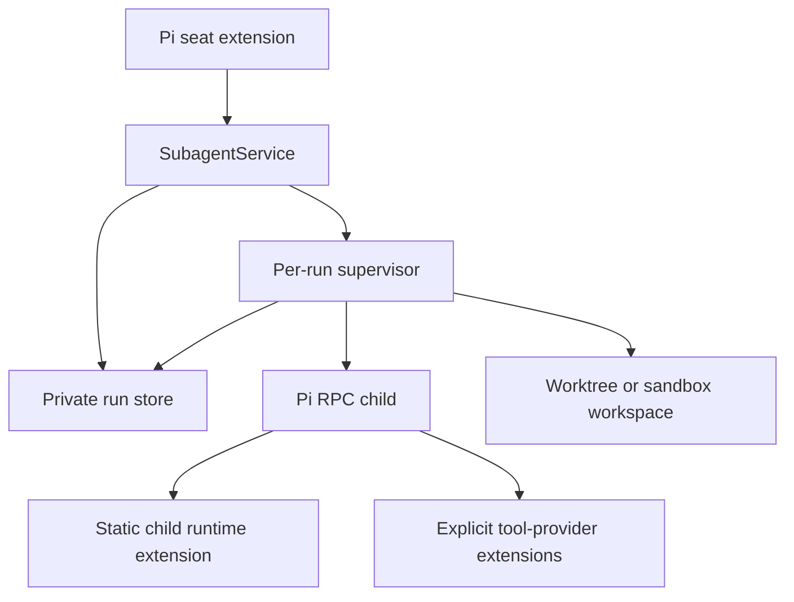
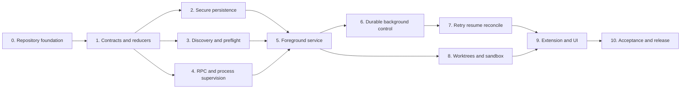

# Implementation plan

## Target

The first stable release is the production core for the tested Pi 0.84 line
(initially `>=0.84.2 <0.85`) on Node.js 22.19 or newer. New Pi minor lines are
qualified explicitly before the supported range expands.

It includes:

- one canonical Pi RPC subprocess backend;
- foreground and durable background runs;
- exact agent/model/resource preflight;
- idempotent launch and opaque owner-bound service clients;
- structured output, bounded artifacts, and usage;
- status, logs, wait, steering, follow-up, and stop;
- retry, retained-session resume, and reconciliation;
- process identity and tracked process-group cleanup proof under the documented
  cooperative-child threat model;
- fail-closed worktrees and sandbox profiles;
- a public `SubagentService` and Pi extension;
- persistent widget and inspector;
- packed-package and real-Pi acceptance tests.

It does not include inline or tmux backends, recursive subagents, schedules,
workflow scheduling, generated web wrappers, web caching, publication, or PR
policy.

## Runtime shape

Every run is supervised by a separate durable supervisor process. The seat never
owns the child Pi process directly. Supervisor loss closes the stock Pi RPC
stdin and therefore interrupts the child; recovery starts from persisted session
state rather than attempting to reconnect to orphaned stdio.



`preflight` and `launch` persist an idempotent request and start or adopt the run
supervisor. Foreground behavior is `launch` followed by `wait`; background
behavior returns after `launch`. Execution mode is observation policy, not a
separate runtime state. A seat restart therefore changes observation, not run
ownership.

The supervisor owns:

- run lease and fencing generation;
- attempt creation;
- workspace preparation;
- child process and RPC connection;
- steering/follow-up delivery;
- event, usage, output, and artifact capture;
- settlement and cleanup;
- heartbeat and terminal receipts.

## Candidate source layout

This is an ownership map, not a requirement to create every module up front.
Begin with cohesive vertical slices and extract files only when the documented
boundary has independent tests or reuse.

```text
src/
  index.ts
  extension.ts
  service.ts
  contract.ts
  schema.ts
  errors.ts
  ids.ts

  agents/
    definition.ts
    discovery.ts
    frontmatter.ts
    resolution.ts

  capabilities/
    registry.ts
    grants.ts
    providers.ts
    projection.ts
    provenance.ts

  model/
    selection.ts
    auth.ts

  launch/
    request.ts
    preflight.ts
    plan.ts
    authority.ts
    supervisor.ts
    worker-extension.ts

  rpc/
    client.ts
    events.ts
    settlement.ts

  lifecycle/
    reducer.ts
    run.ts
    attempt.ts
    retry.ts
    resume.ts
    reconcile.ts
    failure.ts

  control/
    channel.ts
    receipts.ts
    steering.ts

  process/
    identity.ts
    tree.ts
    signals.ts
    terminal-proof.ts

  workspace/
    shared.ts
    worktree.ts
    sandbox.ts
    handoff.ts
    cleanup.ts

  persistence/
    paths.ts
    events.ts
    journal.ts
    snapshot.ts
    lease.ts
    store.ts
    index.ts
    retention.ts

  artifacts/
    store.ts
    export.ts
    output.ts
    truncation.ts

  usage/
    accounting.ts

  ui/
    widget.ts
    inspector.ts
    render.ts

  supervisor/
    main.ts

test/
  unit/
  component/
  integration/
  acceptance/
  fixtures/
```

## Deliverable graph



## Deliverable 0 — repository foundation

### Build

- npm package `@vegardx/pi-subagent`;
- strict TypeScript with NodeNext and explicit `.js` imports;
- Biome, Vitest, and TypeScript gates;
- GitHub Actions CI on macOS and Linux;
- Dependabot for npm and GitHub Actions;
- Pi package manifest with one extension entry;
- public package exports for the service contract and extension;
- Pi core packages and `typebox` as unbundled peer dependencies;
- release and packed-artifact validation scripts.

### Exit gate

- empty extension loads in a clean `PI_CODING_AGENT_DIR`;
- `npm pack --dry-run` contains only intended files;
- CI, formatting, typecheck, unit tests, and smoke pass;
- public API and package manifest are checked mechanically.

## Deliverable 1 — contracts and pure reducers

### Build

- branded run, attempt, owner, operation, session, workspace, and artifact IDs;
- TypeBox schemas matching public TypeScript types;
- runtime capability contract;
- request, preflight, launch plan, receipt, status, result, and control types;
- versioned event envelope and snapshots;
- run and attempt reducers with exhaustive transition tables;
- cleanup-outcome invariants;
- stable classified failure codes and retryability;
- bounded usage and limit types.

### Tests

- schema/type parity;
- every valid and invalid transition;
- property-based event-reduction invariants;
- cleanup-blocked invariants;
- unknown/future versions fail closed;
- serialization bounds and redaction.

### Exit gate

No process, filesystem, model, or Pi runtime code. All state behavior is pure,
versioned, and exhaustively tested.

## Deliverable 2 — secure persistence

### Build

- effective paths rooted under `getAgentDir()`;
- project identity independent of child workspace paths;
- private directory and file modes;
- append-only sequenced event journal;
- atomic bounded snapshots;
- torn-tail and corruption handling;
- fenced single-writer leases;
- idempotency index by owner and operation ID;
- bounded global run pointer index;
- artifact metadata and retention pins;
- retention that preserves active, interrupted, retained, and cleanup-blocked runs.

### Tests

- crash injection around append, fsync, rename, and index update;
- stale writer rejected by fencing token;
- duplicate event and operation replay;
- torn tail accepted only at the final record;
- interior corruption and future schema isolated;
- symlink, hardlink, ownership, and mode checks;
- concurrent process lease tests.

### Exit gate

A deterministic fake supervisor can persist and recover every run/attempt state
without losing or duplicating authority.

## Deliverable 3 — agent discovery and preflight

### Build

- builtin, user-global, and trusted project agent discovery plus a
  pi-subagent-owned manifest for agent definitions shipped by packages;
- deterministic precedence and collision diagnostics;
- agent frontmatter parsing and source provenance;
- self-contained `goal/context/instructions` task validation;
- explicit fresh/fork context mode;
- exact model/thinking resolution through Pi `ModelRuntime`;
- capability and tool-provider registry;
- built-in tool grants and explicit extension-provider grants;
- content/tree digests for agent, extension, skill, prompt, and context resources;
- canonical path, symlink, trust, and workspace validation;
- shared workspace as the only supported profile until Deliverable 8; worktree
  and sandbox requests fail preflight as unsupported;
- immutable preflight record with expiration and launch identity.

### Tests

- source precedence and malformed higher-priority definitions;
- project `.pi` resources and project agent/skill definitions require Pi trust;
- ordinary Pi context files follow an explicitly documented stricter
  pi-subagent policy rather than being described as Pi-native trust behavior;
- model unavailable/auth unavailable failure;
- requested capabilities cannot exceed agent ceiling;
- tool grant and provider extension cannot drift;
- resource mutation after preflight invalidates launch;
- ambient extensions absent by default;
- secrets never serialized into launch records.

### Exit gate

Preflight can resolve a complete immutable launch plan without starting any
process.

## Deliverable 4 — RPC and process supervision

### Build

- Pi executable resolution and supported-version preflight;
- custom supervisor-owned JSONL RPC client and child process spawn;
- child argv with `--mode rpc`, explicit session directory,
  `--no-extensions`, `--no-skills`, `--no-prompt-templates`, `--no-themes`,
  `--no-context-files`, and then only explicit extension/tool/prompt grants;
- static child runtime extension for structured output and runtime receipts;
- RPC startup/readiness handshake and effective-resource attestation;
- authoritative `agent_settled` detection;
- bounded event and output collection;
- process group creation;
- Linux process birth identity and macOS process identity helper/strategy;
- TERM → observe → KILL → prove terminal sequence;
- tracked process-group and birth-identity verification under the documented
  cooperative-child threat model;
- process and RPC terminal receipts;
- abort-aware provider and tool settlement deadlines.

### Tests

- real Pi child smoke on macOS and Linux;
- startup failure before/after spawn and before/after RPC readiness;
- malformed RPC frames and stdout noise;
- provider error, abort, and agent settlement;
- PID/birth mismatch prevents signaling;
- TERM-resistant child and grandchild are proved gone;
- unknown process identity becomes cleanup-blocked;
- output and event limits remain bounded.

### Exit gate

A complete detached supervisor can execute one child to a trustworthy terminal
result, including cancellation and cleanup evidence. Foreground and background
observers use this same supervisor.

## Deliverable 5 — foreground service

### Build

- `createSubagentService()` and opaque owner-bound clients;
- cooperative owner scoping and caller fencing;
- idempotent preflight → launch flow;
- operation lookup/adoption after crash;
- `preflight`, `launch`, `status`, `logs`, `wait`, and `interrupt`;
- strict structured output through a terminating `final_answer` tool;
- at most two bounded repair turns;
- artifact store and bounded export API;
- exact usage aggregation and truncation indicators;
- immutable terminal result with stable result/event ID and idempotent reads.

### Tests

- concurrent duplicate operation ID starts one run;
- same operation ID with a different request identity fails;
- crash after process start but before caller receipt adopts the run;
- one owner-bound client cannot inspect or mutate another owner's runs;
- stale caller fencing token rejected;
- structured output success, repair, and exhaustion;
- artifact digest/export and retention pinning;
- foreground cancellation races with completion;
- partial usage survives failure with an explicit completeness indicator;
- real Pi structured-output cases cover a sole `final_answer`, sibling tool
  calls, schema rejection, and repair exhaustion.

### Exit gate

The service can run one production-quality foreground subagent without the Pi
extension adapter.

## Deliverable 6 — durable background and control

### Build

- durable supervisor discovery/adoption after seat restart;
- supervisor heartbeat and lease loss behavior;
- file-backed bounded control channel;
- ordered idempotent steering, follow-up, and interrupt operations;
- persisted acknowledgements distinguishing stored, session-accepted, missed,
  and failed;
- durable launch receipts suitable for callers that return without waiting;
- durable status/log/wait observation;
- inactive-owner result retention and at-least-once notification projection
  with stable IDs for consumer deduplication;
- service startup scan and supervisor adoption.

### Tests

- parent seat exits while child continues;
- supervisor crashes at every launch/control/terminal checkpoint;
- duplicate/out-of-order controls and queue bounds;
- steering terminal race returns missed;
- restart rebuilds status and delivers one result;
- lost lease fences the old supervisor;
- no polling loop depends on UI process memory;
- repeated notification delivery is harmless through stable-ID deduplication.

### Exit gate

Background runs survive seat replacement and expose trustworthy control and
terminal state.

## Deliverable 7 — retry, resume, and reconciliation

### Build

- failure-class retry policy with run-wide budgets;
- new attempt creation without erasing prior evidence;
- retained Pi session metadata;
- exclusive session lease;
- resume validation of owner, cwd, model, tools, resources, shared workspace,
  and remaining limits; Deliverable 8 extends this contract to isolated
  workspaces;
- reconciliation of persisted run, supervisor, child process, RPC/session,
  control receipts, artifacts, and workspace;
- explicit unknown and cleanup-blocked outcomes;
- operator guidance for non-resumable states.

### Tests

- retry only for classified eligible failures;
- resume creates a new attempt and one session writer;
- concurrent resume loses deterministically;
- stale/missing/corrupt session refuses resume;
- restart with persisted running state but no process reconciles correctly;
- live supervisor with stale snapshot is adopted only with matching identity;
- supervisor-less child is stopped/proved gone or becomes cleanup-blocked, never
  reattached to stock RPC;
- retry/resume preserve cost, limits, and attempt history.

### Exit gate

Every interrupted or ambiguous state has one conservative, tested recovery
classification.

## Deliverable 8 — worktrees and sandbox profiles

### Build

- fail-closed Git repository and cleanliness preflight;
- one deterministic branch/worktree reservation per attempt;
- subdirectory cwd mapping;
- setup hook with bounded output and timeout;
- immutable baseline identity;
- binary/mode/symlink/deletion-safe patch capture;
- immutable commit-based handoff as the authoritative initial format, with
  patches as derived projections;
- cleanup only after durable handoff;
- retained workspace workflow and explicit release;
- an enforceable offline sandbox profile and capability probes;
- optional network-domain allowlist only on platforms where a selected broker
  or sandbox dependency passes acceptance tests;
- sandboxed writable roots excluding supervisor state;
- explicit distinction between worktree and OS sandbox guarantees.

### Tests

- requested isolation never falls back;
- parallel writers receive separate worktrees;
- dirty repositories and branch/path collisions fail before model execution;
- patch fidelity for binary, mode, symlink, rename, and deletion;
- cancellation preserves uncaptured work;
- cleanup failure blocks success;
- offline sandbox denies network and supervisor-store access;
- any advertised allowlist sandbox permits only declared provider/network
  domains; unsupported platforms fail preflight;
- child cannot reach supervisor store in sandbox profile.

### Exit gate

Mutating parallel subagents can return verifiable handoffs without risking the
active checkout or supervisor state.

## Deliverable 9 — Pi extension and UI

### Build

- model-facing `subagent` tool derived from the service schemas;
- command and tool actions for run/status/logs/wait/steer/follow-up/stop/retry/
  resume/reconcile/release;
- explicit active-tool prompt guidance;
- compact persistent widget;
- full run/attempt/transcript/artifact inspector;
- owner-scoped controls and confirmations;
- bounded rendering and terminal-safe text;
- session replacement and reload rehydration;
- versioned service capability registration for pi-workflow.

### Tests

- tool schema/public service schema parity;
- no duplicate ownership or hidden alternate implementation;
- source provenance for tools and commands;
- widget bounds and malformed persisted records;
- inspector authorization and artifact path containment;
- controls invoke service operations with idempotency/fencing;
- reload and session switch retain correct owner routing.

### Exit gate

The extension is a thin, tested adapter over the standalone service.

## Deliverable 10 — acceptance and stable release

### Build

- execute every item in `docs/acceptance.md`;
- packed installation into a fresh `PI_CODING_AGENT_DIR`;
- real custom-provider model qualification;
- real explicit `pi-web-access` child tool qualification;
- workflow-consumer compatibility fixture;
- macOS and Linux process/worktree/sandbox acceptance;
- crash/fault-injection suite;
- performance and resource-bound measurements with published numeric defaults
  for output, logs, events, artifacts, controls, snapshots, runtime, retries,
  tokens, and cost;
- security review and third-party notices;
- migration/versioning policy and release documentation.

### Stable-release gate

- no acceptance claim relies only on mocks;
- no known path reports completion without required terminal and cleanup proof;
- runtime and model-facing capability contracts match implementation;
- packed artifact contains and loads the static child extension;
- bounded supported Pi/Node/platform matrix is documented and tested;
- pi-workflow integration uses the public service without private runtime
  duplication.

## Public API target

```ts
export {
	createSubagentService,
	SUBAGENT_RUNTIME_CONTRACT,
	type SubagentServiceV1,
	type SubagentRequest,
	type SubagentPreflight,
	type AgentLaunchPlan,
	type RunReceipt,
	type RunStatus,
	type RunResult,
	type ControlReceipt,
	type ArtifactRef,
	type ArtifactExport,
} from "@vegardx/pi-subagent";
```

The extension entry is a separate export:

```text
@vegardx/pi-subagent/extension
```

The package manifest loads only that extension entry.

## Release increments

| Version target | Capability |
| --- | --- |
| 0.1 | Foundation, contracts, persistence primitives |
| 0.2 | One-shot RPC attempt runner and preflight |
| 0.3 | Foreground service and structured output |
| 0.4 | Durable background control and UI preview |
| 0.5 | Retry, resume, reconciliation |
| 0.6 | Worktrees and sandbox profiles |
| 0.9 | Full acceptance candidate and workflow compatibility |
| 1.0 | Production-core stable contract |

Versions are capability milestones, not deadlines. A milestone is released only
when its bounded acceptance evidence passes.

## Cross-repository dependency

`pi-workflow` may develop against a fake `SubagentServiceV1` after Deliverable 1.
Packed integration begins only after the required service features have real
acceptance evidence. Workflow must check the runtime feature contract at
startup rather than infer support from package version.

The workflow contract must track the finalized owner-bound client and
`preflight → launch → optional wait` semantics. Foreground/background behavior
belongs to the workflow caller's observation policy, not `SubagentRequest`.
